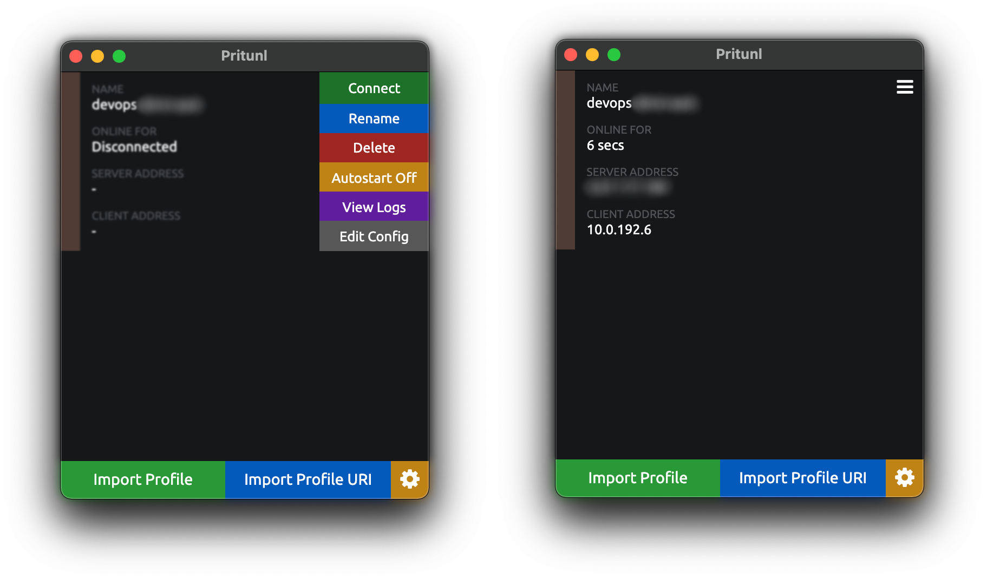

# VPN: Pritunl

By default, our network hosts are not accessible from the outside, VPN will allow you to access them via their private IP addresses.

## TODO

- [ ] update guide for `terragrunt`

## Terrafrom setup

As a VPN server we use [Pritunl](https://pritunl.com/). The EC2 instance **pritunl-vpn** where the server runs is deployed in common-vpc, so it has access to all vpc networks. More about the network architecture:

We used terraform to deploy the VPN server. The code is stored in the file `terraform/aws/live/common/vpn.tf` and relies on a custom module (module code: `terraform/aws/modules/pritunl/`).

## Deploy

* upd `common_public_0` data to fetch public subnet 
* add public ssk key to `aws_key_pair.common`

`main.tf`
```terraform
data "aws_subnet" "common_public_0" {
  vpc_id     = module.vpc.vpc_id
  cidr_block = var.vpc_public_subnets[0]
}

resource "aws_key_pair" "common" {
  key_name   = "vpn-admin"
  public_key = "ssh-rsa ******"
  tags = merge(
    var.tags,
    {
      Name = "vpn-admin"
    },
  )
}

variable "vpn_admins" {
  type = list(object({
    name    = string
    ip_list = list(string)
  }))
  sensitive   = false
  description = "Pritunl admins"
  validation {
    condition = alltrue([
      for user in var.vpn_admins : alltrue([
        for cidr in user.ip_list : can(
          regex("^\\d{1,3}\\.\\d{1,3}\\.\\d{1,3}\\.\\d{1,3}/32$", cidr)
        )
      ])
    ])
    error_message = "Wrong admin IP list. Example: [\"82.82.82.82/32\"]."
  }
}

variable "vpn_users" {
  type = list(object({
    name    = string
    ip_list = list(string)
  }))
  sensitive   = false
  description = "Pritunl users"
  validation {
    condition = alltrue([
      for user in var.vpn_users : alltrue([
        for cidr in user.ip_list : can(
          regex("^\\d{1,3}\\.\\d{1,3}\\.\\d{1,3}\\.\\d{1,3}/32$", cidr)
        )
      ])
    ])
    error_message = "Wrong user IP list. Example: [\"82.82.82.82/32\"]."
  }
}

locals {
  vpn_admin_cidrs = concat([
    for admin in var.vpn_admins : [
      for ip in admin.ip_list : ip
    ]
  ]...)
  vpn_user_cidrs = concat(local.vpn_admin_cidrs, [
    for user in var.vpn_users : [
      for ip in user.ip_list : ip
    ]
  ]...)
}

module "terraform-aws-pritunl" {
  source = "../../modules/pritunl"

  aws_key_name     = aws_key_pair.common.key_name
  public_subnet_id = data.aws_subnet.common_public_0.id
  admin_cidrs      = local.vpn_admin_cidrs
  user_cidrs       = local.vpn_user_cidrs

  volume_extra_tags = {
    Snapshot = "true"
  }

  tags = merge(
    var.tags,
    {
      Name = "pritunl-vpn"
    },
  )
}

resource "aws_route53_zone" "home_lab" {
  name = "home.lab"
  tags = var.tags
}

resource "aws_route53_record" "common_vpn" {
  zone_id         = aws_route53_zone.home_lab.zone_id
  name            = "common-vpn.home.lab"
  type            = "A"
  ttl             = "300"
  records         = [module.terraform-aws-pritunl.elastic_ip]
  allow_overwrite = true
}
```

### Access

VPN is only accessible from IP addresses in the lists stored in `terraform/aws/live/common/terraform.tfvars`

```terraform
vpn_admins = [
  {
    name    = "Andrew Ozhegov"
    ip_list = ["88.88.88.88/32"]
  },
  {
    name    = "Dante Aligieri"
    ip_list = ["77.77.77.77/32"]
  },
]
vpn_users = []
```

Currently, there are two types of users:
- `users` have access to the web interface
- `admins` additionally have ssh access to network instances

### Backup & Restore

We use **EBS Lifecycle Manager** (DLM) to take a daily snapshot of the pritunl-vpn instance.
We store snapshots for the last 7 days. Terraform code `aws_dlm_lifecycle_policy` in the file `terraform/aws/live/common/vpn_backup.tf`

If necessary, we will use snapshot to roll back or restore the state of the vpn server. Step-by-step instructions for recovery from aws:

> **Restoring from an Amazon EBS snapshot or an AMI**
> To reduce the recovery time and impact to dependent applications and processes, your restore process must consider the resource that it is replacing.  
> [https://docs.aws.amazon.com/prescriptive-guidance/latest/backup-recovery/restore.html#restore-snapshot](https://docs.aws.amazon.com/prescriptive-guidance/latest/backup-recovery/restore.html#restore-snapshot)
```terraform
resource "aws_iam_role" "dlm_lifecycle_role" {
  name = "dlm-lifecycle-role"

  assume_role_policy = <<EOF
{
  "Version": "2012-10-17",
  "Statement": [
    {
      "Action": "sts:AssumeRole",
      "Principal": {
        "Service": "dlm.amazonaws.com"
      },
      "Effect": "Allow",
      "Sid": ""
    }
  ]
}
EOF

  tags = var.tags
}

#tfsec:ignore:aws-iam-no-policy-wildcards
resource "aws_iam_role_policy" "dlm_lifecycle" {
  name = "dlm-lifecycle-policy"
  role = aws_iam_role.dlm_lifecycle_role.id

  policy = <<EOF
{
   "Version": "2012-10-17",
   "Statement": [
      {
         "Effect": "Allow",
         "Action": [
            "ec2:CreateSnapshot",
            "ec2:CreateSnapshots",
            "ec2:DeleteSnapshot",
            "ec2:DescribeInstances",
            "ec2:DescribeVolumes",
            "ec2:DescribeSnapshots"
         ],
         "Resource": "*"
      },
      {
         "Effect": "Allow",
         "Action": [
            "ec2:CreateTags"
         ],
         "Resource": "arn:aws:ec2:*::snapshot/*"
      }
   ]
}
EOF
}

resource "aws_dlm_lifecycle_policy" "pritunl_vpn" {
  description        = "VPN server volume DLM lifecycle policy"
  execution_role_arn = aws_iam_role.dlm_lifecycle_role.arn
  state              = "ENABLED"

  policy_details {
    resource_types = ["VOLUME"]

    schedule {
      name = "Last week of daily snapshots"

      create_rule {
        interval      = 24
        interval_unit = "HOURS"
        times         = ["23:45"]
      }

      retain_rule {
        count = 7
      }

      tags_to_add = {
        SnapshotCreator = "DLM"
      }

      copy_tags = true
    }

    target_tags = {
      Snapshot = "true"
    }
  }

  tags = merge(
    var.tags,
    {
      Name = "pritunl-vpn"
    },
  )
}
```

## Setup guide

### Add user's IP to allowed list


`terraform/aws/live/common/terraform.tfvars`

```diff
vpn_users = [
+  {
+    name    = "YourName"
+    ip_list = ["7.7.7.7/32"] # your ip
+  },
]
```

### Setup VPN Client

- Access portal:

  1. [https://common-vpn.home.lab/](https://common-vpn.home.lab/) -> `Sign in with Google`
  2. Download Pritunl client and copy **Profile URI Link**


- Pritunl client: `Import Profile URI` -> paste **Profile URI Link**


- Connect to VPN



- Done!
