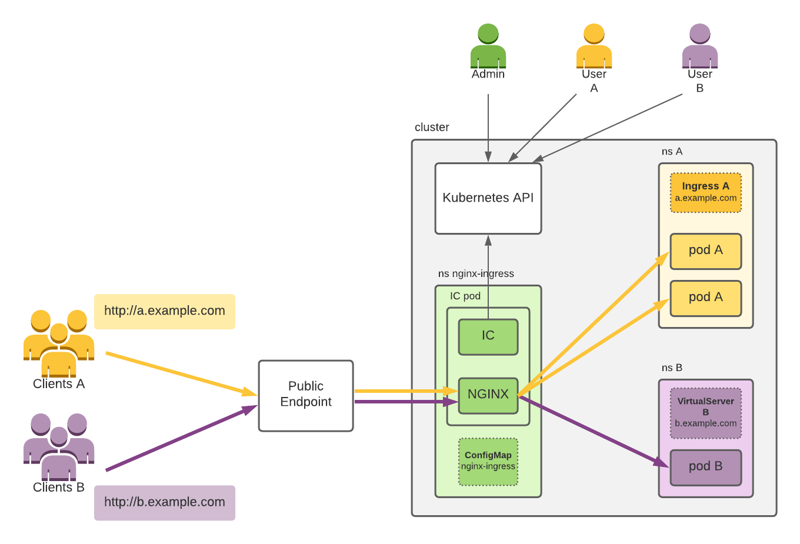

# NGINX Ingress Controller

|**Distro**|[Ingress NGINX Controller](https://github.com/kubernetes/ingress-nginx)|
|-|-|
|**Type**|deployment|
|**Deploy**|helm-chart|
|**Docs**|[link](https://docs.nginx.com/nginx-ingress-controller/)|
|**Backup**||
|**Scaling**||
|**CLI**||
|**UI**|web|

## Architecture



## Usecases

### :white_check_mark: Basic Setup: Local DNS + TLS

* [Local Kind single-cluster setup: NGINX Ingress + local DNS](../../infra/k8s/cluster-local-kind.md#nginx-ingress--local-dns)
* [cert-manager: Basic: TLS for local ingress-nginx (self-signed CA)](../tls/cert-manager.md#white_check_mark-basic-tls-for-local-ingress-nginx-self-signed-ca)
### Common:

## :white_check_mark: Monitoring

:::note Grafana Dashboard
https://grafana.com/grafana/dashboards/16677-ingress-nginx-overview/
:::

```yaml
ingress-nginx:
  controller:
    metrics:
      enabled: true
      serviceMonitor:
        enabled: true
```

## Maintenence

- Backup / Restore
- Scaling
- Upgrade

---

## Articles

* [Example article link](#)
