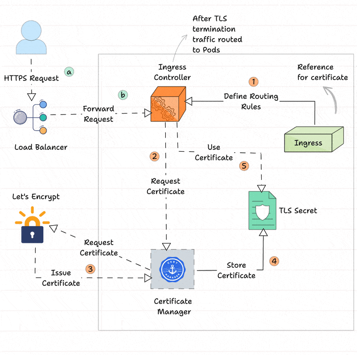

# cert-manager

||Self-hosted|SaaS|
|-|-|-|
|**Name**|[cert-manager](https://cert-manager.io)||
|**Type**|kubernetes-operator||
|**Deploy**|helm-chart||
|**Backup**|manual||
|**Scaling**|||
|**CLI**|[cmctl](https://cert-manager.io/docs/reference/cmctl/)||
|**UI**|||

## :white_check_mark: Architectire

* creates TLS certificates for workloads in your Kubernetes or OpenShift cluster and renews the certificates before they expire.
* can obtain certificates from a variety of certificate authorities, including: Let's Encrypt, HashiCorp Vault, Venafi and private PKI.
* private key and certificate are stored in a Kubernetes Secret which is mounted by an application Pod or used by an Ingress controller
* With csi-driver, csi-driver-spiffe, or istio-csr , the private key is generated on-demand, before the application starts up; the private key never leaves the node and it is not stored in a Kubernetes Secret.



1. The Ingress object will be created with the reference of the Cert Manager Issuers.
2. The Ingress Controller will get the information from the Ingress object and request a certificate from the Cert Manager.
3. The Cert Manager will request the Certificate Authority, for example, Let's Encrypt.
4. After the verification, the CA will generate and provide the certificate to the Cert Manager.
5. The generated certificate will be stored in Kubernetes as a TLS Secret.
6. The Ingress Controller will encrypt the traffic using the stored certificate for the TLS termination.
7. When a user tries to access the application, the external traffic is routed from the external Load Balancer to the Ingress Controller.
8. The TLS termination will happen in the Ingress Controller with the TLS certificate and securely route the traffic to the application Pods.

## Usecases

### :white_check_mark: Basic: TLS for local ingress-nginx (self-signed CA)

self-signe CA cert for local use

```bash
openssl genrsa -out ca.key 4096
openssl req -new -x509 -sha256 -days 365 -key ca.key -out ca.crt
sudo security add-trusted-cert -d -r trustRoot -k /Library/Keychains/System.keychain ca.crt
kubectl create secret generic -n vault ca --from-file=tls.crt=ca.crt --from-file=tls.key=ca.key
```

create a `ClusterIssuer` for self-signed CA

```yaml
apiVersion: cert-manager.io/v1
kind: ClusterIssuer
metadata:
  name: cluster-issuer-nginx
spec:
  ca:
    secretName: ca
```

create a `Certificate` for `ingress-nginx`

```yaml
apiVersion: cert-manager.io/v1
kind: Certificate
metadata:
  name: demo-cert
spec:
  secretName: demo-tls-secret
  issuerRef:
    name: cluster-issuer-nginx
    kind: ClusterIssuer
  dnsNames:
    - demo.home.lab
```

use secret created by `Certificate` in `Ingress` resource definition:

```yaml
apiVersion: networking.k8s.io/v1
kind: Ingress
metadata:
  name: demo
spec:
  # . . .
  tls:
  - hosts:
    - demo.home.lab
    secretName: demo-tls-secret
```

### Common: TLS for exposed ingress-nginx (Let's Encrypt)

:::tip Let's Encrypt Example
https://www.f5.com/company/blog/nginx/automating-certificate-management-in-a-kubernetes-environment
:::

- [ ] letsencrypt
- [ ] cloudflare
- [ ] aws/gcp/azure
- [ ] vault-pki

### Advanced: secure Istio service mesh

## :arrows_counterclockwise: Monitoring

:::note Official docs
https://cert-manager.io/docs/devops-tips/prometheus-metrics/
:::

:::note Grafana Dashboard
https://grafana.com/grafana/dashboards/22908-cert-manager-kubernetes/
:::

- enable metrics and `PodMonitor`

```yaml
cert-manager:
  prometheus:
    enabled: true
    podmonitor:
      enabled: true
```

## Maintenence

- Install / Deploy
- Backup / Restore

  https://cert-manager.io/v1.1-docs/tutorials/backup/

- Scaling
- Upgrade

## Patform integration

how this tool integrated into a platform
how to use it in a platform
how to debug

---

## Articles

* [Example article link](#)
